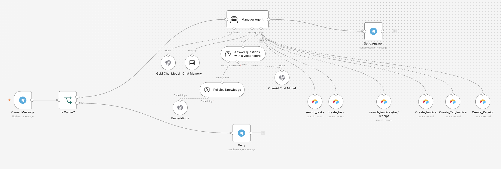
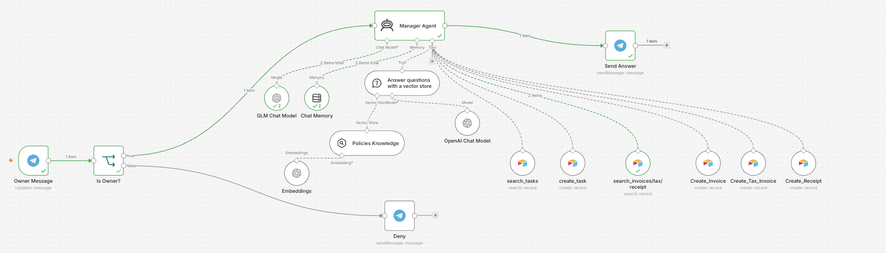
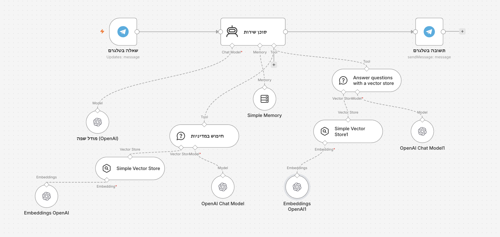
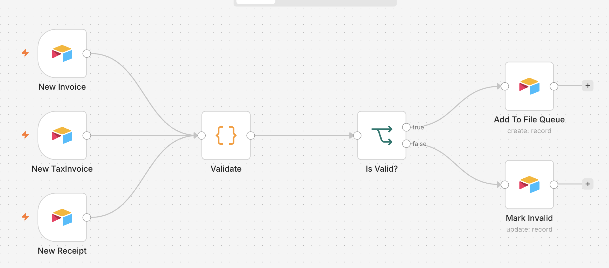
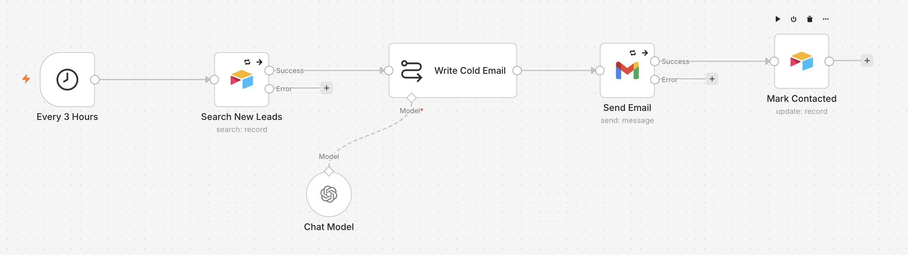
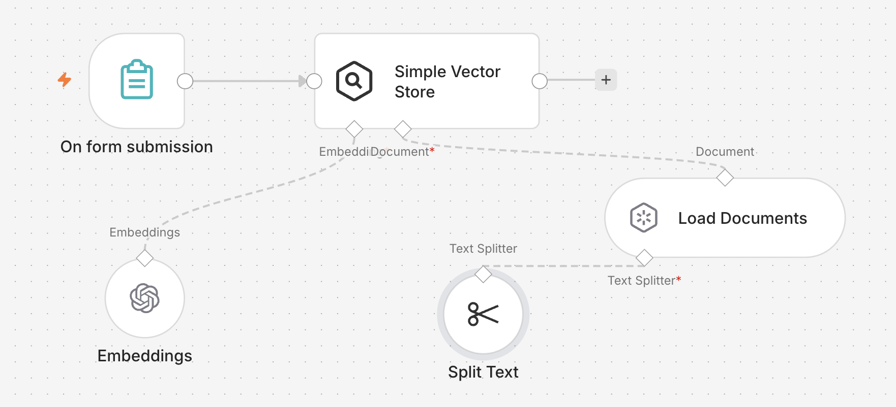
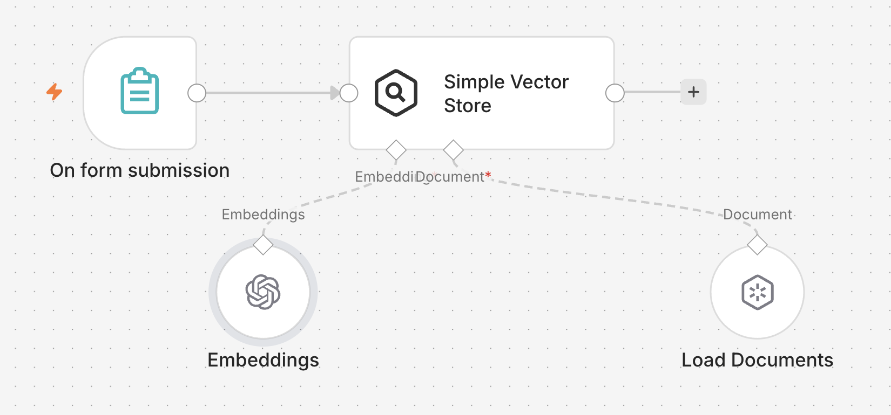

# AI-ERP with n8n

A small, **learning-oriented** ERP for a fictional Israeli electronics business, built with **n8n**, **AI agents**, and **RAG**. Everything is deliberately simple: short workflows, nothing to install, nothing to run locally.

The whole system is **n8n Cloud + Airtable**. Airtable is the database and the UI, n8n Cloud runs the automation, documents are rendered to PDF and stored in Google Drive. Nothing else — no Docker, no server, no local install.

---

## What's in the box

- **3 AI agents** — a **Manager** agent (owner-only, analytics + tasks), a **Customer Service** agent (customers, RAG-grounded), and a **Sales** agent (cold emails + reply heartbeat).
- **9 n8n workflows** covering tax-document validation, contact intake, sales outreach, RAG embedding pipelines, and a PDF→Google-Drive pipeline.
- **RAG** over the business policies + the product catalogue, using n8n's built-in vector store.
- **Basic Israeli tax rules** — 18% VAT (17% before 2025-01-01), sequential document numbers, tax-invoice / receipt / invoice distinction.

> **Data:** the project ships with **no pre-generated data**. `schema/schema.json` is the source of truth for the 8 tables; you build the tables and populate records yourself as you develop. The RAG policy docs live in `mock/policies/`.

---

## Architecture

```
                     ┌──────────────┐
  Telegram bot #1 ──▶│              │──▶ Airtable  (the database)
  (manager)          │              │
  Telegram bot #2 ──▶│  n8n Cloud   │──▶ Gmail     (sales emails)
  (customers)        │  + AI agents │──▶ Drive     (documents + PDFs)
                     │  + vectorDB  │
  Gmail  ───────────▶│              │
  Schedules ────────▶└──────────────┘
                            ▲
                            │  chat model · embeddings model
```

Everything runs inside n8n Cloud. It gives you a public HTTPS URL out of the box, so the Telegram bots and any webhook work with no tunnel and no port forwarding.

### Models

Both are configured in their n8n credentials and swappable — nothing in the workflows is tied to a particular vendor.

- **Chat** — any OpenAI-compatible endpoint. n8n's OpenAI nodes talk to it once you override the Base URL in the credential.
  ⚠️ If you pick a *reasoning* model, never set a small `max_tokens`, or `content` comes back empty.
- **Embeddings** — a separate OpenAI-compatible endpoint. Pick a **multilingual** model so Hebrew embeds properly. It's separate because a chat endpoint does not necessarily serve `/v1/embeddings` — check before assuming one endpoint covers both.

---

## Quick start

### 1. Get the accounts

- an **n8n Cloud** workspace — <https://app.n8n.cloud>
- an **Airtable** base + personal access token — [docs/01-airtable.md](docs/01-airtable.md)
- **two Telegram bots** — [docs/02-telegram-bots.md](docs/02-telegram-bots.md)
- **Google OAuth** for Gmail + Drive — [docs/03-google-oauth.md](docs/03-google-oauth.md)
- a **chat** endpoint and an **embeddings** endpoint (any OpenAI-compatible ones)

### 2. Build the Airtable base

Create the 8 tables from `schema/schema.json`, and add a `Created` "Created time" field to the trigger tables — the triggers need it. See [docs/01-airtable.md](docs/01-airtable.md). Populate records as you build.

### 3. Add the credentials in n8n

**Credentials → New**, one per service, named exactly as listed in [docs/04-workflows.md](docs/04-workflows.md).

### 4. Build the workflows

Build them in the n8n editor following [docs/04-workflows.md](docs/04-workflows.md).

### 5. Fill the vector store

Run **Policies Embedding** and **Products Embedding** by hand.
⚠️ n8n's Simple Vector Store is **in-memory**: re-run both whenever your instance restarts.

### 6. Try it

- Message your **support bot**: *"מה מדיניות ההחזרות?"* or *"do you have wireless headphones?"*
- Message your **manager bot**: *"what were earnings last month?"*, *"create a task to call supplier X"*
- Create an Invoice row in Airtable → validation runs → a PDF lands in Drive.

---


## Repo layout

```
schema/schema.json     ← single source of truth (8 tables). Everything reads this.
mock/policies/         ← policy/business-rule docs (*.md) for RAG — upload these to Drive
templates/             ← invoice / receipt / quote HTML (RTL Hebrew)
docs/                  ← step-by-step setup guides + canvas screenshots
```

Nothing here is deployed or executed. The repo holds the schema, the content the workflows consume, and the guides — the workflows themselves live in n8n Cloud.

---

## The workflows

| # | Workflow | Trigger |
|---|----------|---------|
| 1 | Tax-doc validation → file queue | new Invoice / TaxInvoice / Receipt |
| 3 | Contact intake + dedupe | new Lead |
| 4a | Sales agent — cold emails | every 3 hours |
| 4b | Sales agent — reply check | Gmail |
| 5 | Customer service agent | Telegram bot #2 |
| 6 | Policies → vector store | manual |
| 7 | Products → vector store | manual |
| 8 | Document → PDF → Google Drive (via Drive conversion) | every minute |
| 9 | Manager agent | Telegram bot #1 |

---

---

## Screenshots

All of these are the live n8n Cloud canvases — the repo itself holds no runnable code.

### WF9 — Manager agent (Telegram bot #1)

Owner check → agent with the policy vector store plus Airtable tools (`search_tasks`, `create_task`, `search_invoices/tax/receipt`, `Create_Invoice`, `Create_Tax_Invoice`, `Create_Receipt`). Anyone who is not the owner falls to **Deny**.



The same workflow mid-run — green edges are the path a single Telegram message actually took:



### WF5 — Customer service agent (Telegram bot #2)

Telegram question → agent with two vector-store tools (policy search + product knowledge) → Telegram answer. Grounded in RAG, so it answers from the policies and the catalogue rather than from the model.



### WF1 — Tax-document validation

Three Airtable triggers (Invoice / TaxInvoice / Receipt) share one **Validate** code node. Valid documents go to the file queue that WF8 picks up; invalid ones get marked on the record.



### WF4a — Sales agent, cold emails

Every 3 hours: search new leads → write the email with the chat model → send via Gmail → mark the lead contacted. ⚠️ This one sends real email.



### WF6 / WF7 — Embedding pipelines

Both have the same shape: trigger → load documents → embed → Simple Vector Store. One splits long text into chunks first; the other loads short records straight in.





### Airtable dashboard

The optional single-file `dashboard.html` — paste a base ID and a personal access token and it reads the tables straight from the Airtable API. It is **not** in the repo (it is gitignored, since a working copy holds a real token).


---

## Known limitations (deliberate, for simplicity)

- **The vector store and agent memory are in-memory** — both are wiped when the instance restarts. Re-run the two embedding workflows.
- **No local files.** n8n Cloud has no filesystem you control, so anything the workflows read (policy documents, HTML templates) comes from Google Drive or lives inside the workflow itself.
- **Airtable triggers poll at ≥1 minute**, and fire off a `Created time` field (Airtable has no true "on create" event).
- **Sequential invoice numbering can race** if two documents are created inside the same poll window.
- **Google OAuth in "Testing" mode** expires refresh tokens after 7 days.
- **Relationships are string foreign keys** (`CUST-0001`), not Airtable links.

## Docs

1. [Airtable setup](docs/01-airtable.md) · 2. [Telegram bots](docs/02-telegram-bots.md) · 3. [Google OAuth](docs/03-google-oauth.md) · 4. [Building the workflows](docs/04-workflows.md)
