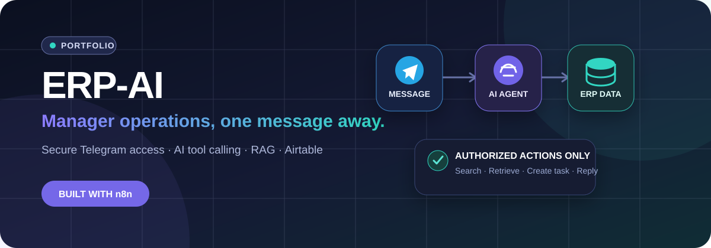
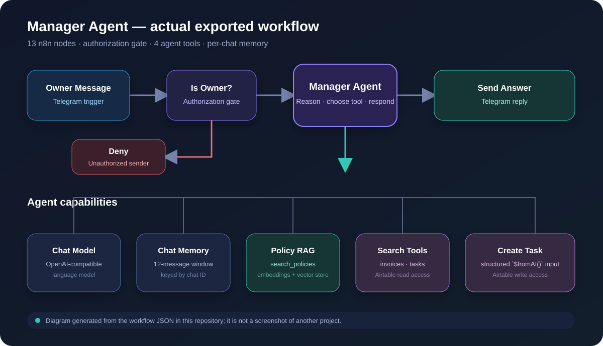

<p align="center">
  
</p>

<h1 align="center">ERP-AI Manager Agent</h1>

<p align="center">
  A portfolio project that turns Telegram into a natural-language interface for ERP operations.<br>
  Built with n8n, AI tool calling, RAG, Airtable, and the Telegram Bot API.
</p>

<p align="center">
  
  
  
  
  
</p>

<p align="center"><strong>English</strong> · <a href="#תקציר-בעברית">עברית</a></p>

---

## Project overview

ERP-AI is a learning and portfolio implementation of a **manager-facing AI agent** for a fictional Israeli electronics business. An authorized manager can message a Telegram bot in natural language, ask operational questions, search Airtable records, consult business policies, and create tasks.

The repository currently contains one importable n8n workflow: [`6 - Manager Agent.json`](6%20-%20Manager%20Agent.json). The documentation below intentionally describes that implemented scope.

### What the project demonstrates

- **Agentic workflow design** — an LLM selects and calls narrowly scoped business tools.
- **Authorization before inference** — the sender is checked before the AI agent runs.
- **Operational data access** — Airtable tools search invoices and tasks and create tasks.
- **Retrieval-augmented answers** — a policy knowledge store is exposed as a retrieval tool.
- **Conversation context** — memory is isolated by Telegram chat ID.
- **Multilingual interaction** — the system prompt instructs the agent to reply in the manager's language.
- **Human-safe behavior** — irreversible actions require confirmation in the agent instructions.

## Workflow architecture

<p align="center">
  
</p>

The main path is deliberately short: receive a Telegram message, verify the owner, let the agent use approved tools, and return the answer. AI capabilities are attached to the agent as explicit model, memory, retrieval, and Airtable-tool connections.

## Included capabilities

| Capability | Implementation | Repository status |
|---|---|---|
| Telegram manager interface | Telegram trigger and reply nodes | Included |
| Owner-only access | Chat ID check before the agent | Included; requires configuration |
| AI manager | n8n LangChain Agent with an OpenAI-compatible chat model | Included; requires credentials |
| Invoice search | Airtable tool callable by the agent | Included; table mapping required |
| Task search | Airtable tool callable by the agent | Included; table mapping required |
| Task creation | Airtable create tool using `$fromAI()` parameters | Included; field mapping required |
| Policy lookup | In-memory vector store exposed as `search_policies` | Included; knowledge must be loaded |
| Short-term memory | Per-chat buffer window | Included; not persistent |

## Example demo

Once the workflow is connected to test data, a manager can ask:

```text
"Show me the outstanding invoices."
"What open tasks do we have?"
"Create a high-priority task to call the supplier."
"What does our returns policy say?"
```

An unauthorized Telegram user follows the deny branch and never reaches the AI agent.

## Technology stack

| Layer | Technology | Role |
|---|---|---|
| Orchestration | n8n | Triggers, branching, integrations, and execution |
| AI | OpenAI-compatible chat and embedding nodes | Reasoning, tool selection, and embeddings |
| Agent pattern | Tool calling + RAG | Grounded access to business data and policies |
| Data | Airtable | Operational records for invoices and tasks |
| Interface | Telegram Bot API | Manager conversation channel |
| Memory | n8n Window Buffer Memory | Short per-chat conversational context |

## Quick start

### Prerequisites

- An n8n instance with the AI/LangChain nodes available
- A Telegram bot token
- An Airtable base with invoice and task tables
- Chat-model and embedding-model credentials compatible with n8n's OpenAI nodes

### Import and configure

1. Download [`6 - Manager Agent.json`](6%20-%20Manager%20Agent.json).
2. In n8n, select **Import from File** and choose the downloaded JSON.
3. Replace every imported credential reference with credentials from your own accounts.
4. Configure `OWNER_TELEGRAM_CHAT_ID` and `AIRTABLE_BASE_ID`. The export currently reads them through `$env`; use environment variables on self-hosted n8n or adapt the expressions to the variable mechanism available in your n8n plan.
5. Select the correct Airtable base, tables, and fields in `search_invoices`, `search_tasks`, and `create_task`.
6. Load policy content into the vector store, or replace the in-memory store with a persistent vector database.
7. Test the owner and deny paths with non-production data.
8. Activate the workflow only after every tool returns the expected records.

> [!IMPORTANT]
> Never commit bot tokens, API keys, Airtable personal access tokens, customer data, or production credentials. Exported credential IDs are references only and must be remapped after import.

## Repository layout

```text
ERP-AI/
├── 6 - Manager Agent.json    # Importable n8n workflow
├── docs/assets/              # Original README visuals
├── ai-erp-n8n-main.zip       # Legacy archive; not required by the workflow
├── AGENTS.md                 # Repository guidance for coding agents
└── README.md                 # Project documentation
```

## Design decisions

- **Tools instead of broad database access:** the agent receives only the operations it needs.
- **Authorization first:** rejected users do not consume model calls or reach business tools.
- **Provider flexibility:** model nodes use OpenAI-compatible credentials and can be remapped.
- **Simple portfolio deployment:** the workflow stays compact and can be demonstrated from Telegram.

## Current limitations and next steps

- `search_invoices` and `search_tasks` still need to be mapped to the correct Airtable tables for each deployment.
- The policy vector store and chat memory are in-memory and are cleared when the n8n instance restarts.
- The repository demonstrates the manager-agent workflow; it does not currently include the full multi-workflow ERP suite.
- There are no automated integration tests because execution and credentials live in n8n.
- Before production use, add durable vector storage, structured error handling, audit logging, least-privilege credentials, and explicit confirmation around write operations.

## Attribution

This implementation was developed as a learning project based on the course concepts and reference architecture published by **Tomer Fooks** in [`tomerfooks/jb-erp-ai`](https://github.com/tomerfooks/jb-erp-ai). This README and its diagrams are original and describe the files present in this repository.

---

## תקציר בעברית

**ERP-AI** הוא פרויקט לימודי ותיק עבודות שמחבר בין Telegram, ‏n8n, ‏Airtable וסוכן AI. מנהל מורשה יכול לכתוב לבוט בשפה טבעית, לחפש חשבוניות ומשימות, להתייעץ עם מאגר נהלים וליצור משימות חדשות.

המאגר כולל כרגע workflow אחד לייבוא ל‑n8n: [`6 - Manager Agent.json`](6%20-%20Manager%20Agent.json). ה‑workflow בודק את זהות השולח לפני הפעלת הסוכן, מחבר לסוכן כלי Airtable מוגדרים, זיכרון שיחה קצר וכלי RAG לשליפת נהלים, ושולח את התשובה בחזרה לטלגרם.

### נקודות מרכזיות

- אימות בעלים לפני הרצת מודל ה‑AI
- Tool Calling לחיפוש נתונים וליצירת משימות
- RAG עבור נהלים וידע עסקי
- זיכרון שיחה נפרד לפי מזהה צ'אט
- תמיכה בשיחה בעברית ובאנגלית
- הפרדה בין יכולות קריאה וכתיבה באמצעות כלים ייעודיים

זהו פרויקט לימודי שנועד להדגמה ולתיק עבודות, ולא מערכת ERP מוכנה לייצור. לפני שימוש אמיתי יש להשלים מיפוי Airtable, אחסון וקטורי קבוע, טיפול בשגיאות, לוגים והרשאות מינימליות.
